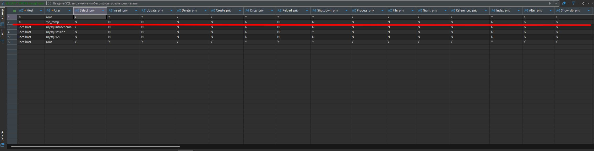
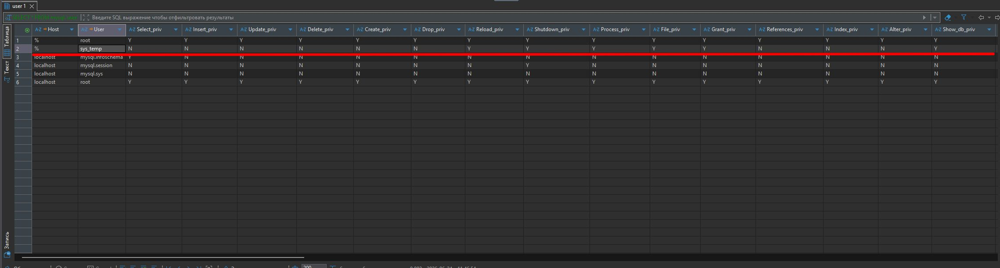
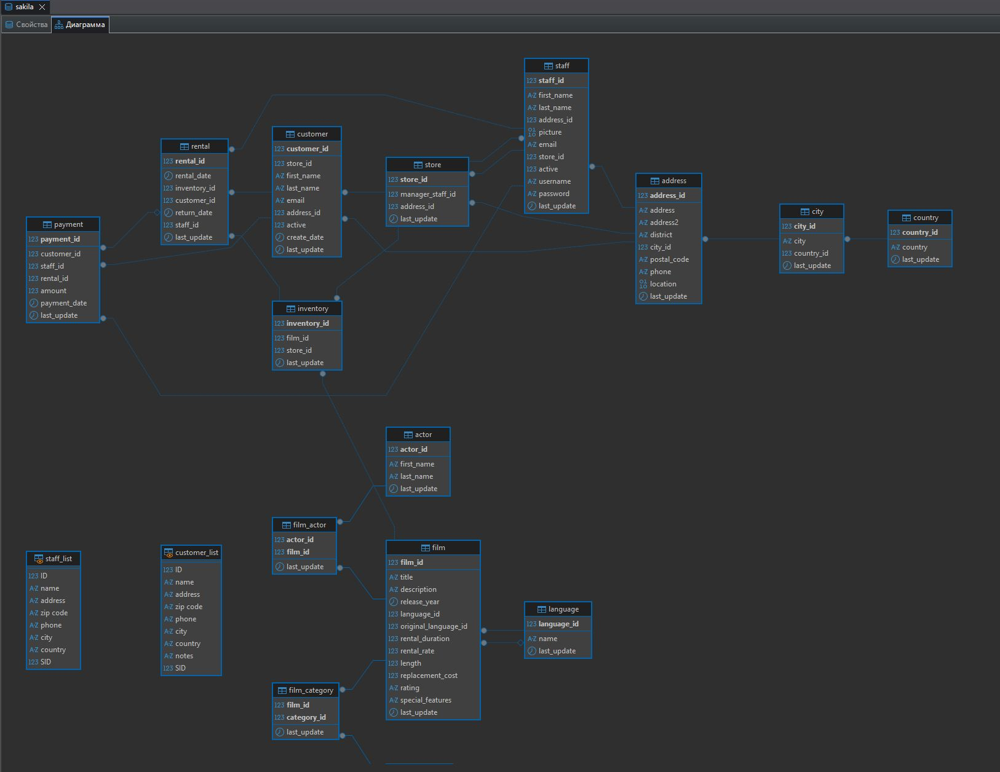
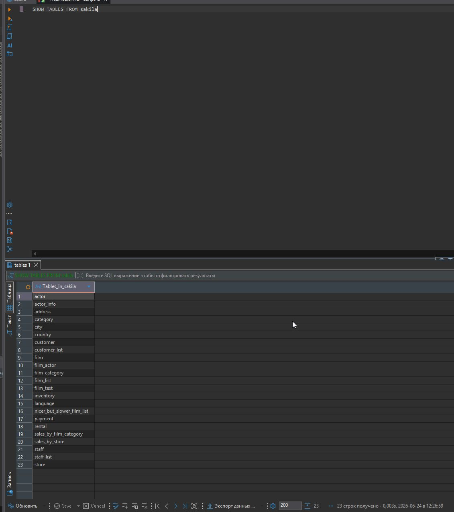
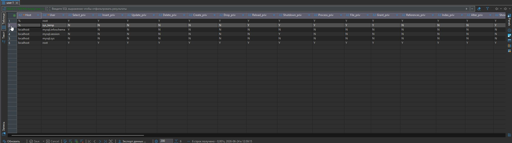

# Домашнее задание к занятию «Введение в SQL»

**Студент:** Тапилин Артём

## Задание 1

1. Создана учётная запись `sys_temp`.
2. Пользователю выданы необходимые права доступа.
3. Выполнен импорт учебной базы данных `sakila`.
4. Проверен вывод данных в табличном виде.

### Скриншоты









## Задание 2

Составлена таблица сопоставления полей.

### Скриншот


## Задание 3

У пользователя `sys_temp` отозваны права на внесение, изменение и удаление данных из базы `sakila`.

### SQL-запрос

```sql
REVOKE INSERT, UPDATE, DELETE ON sakila.* FROM 'sys_temp'@'%';
```

### Скриншот

